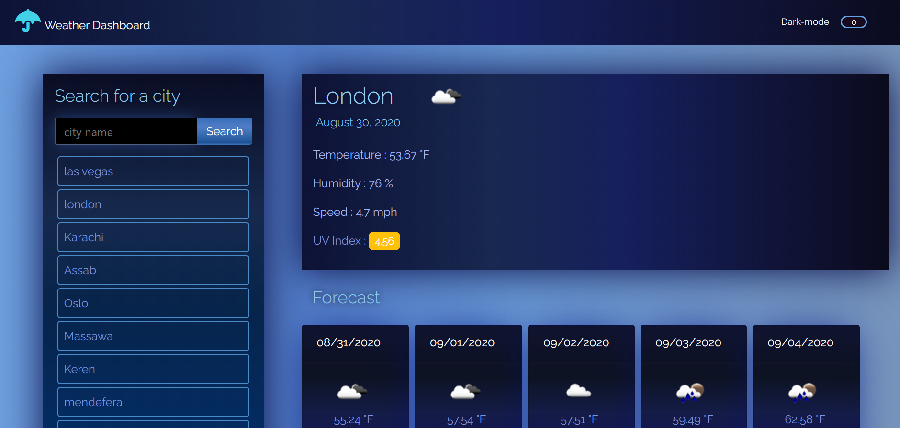
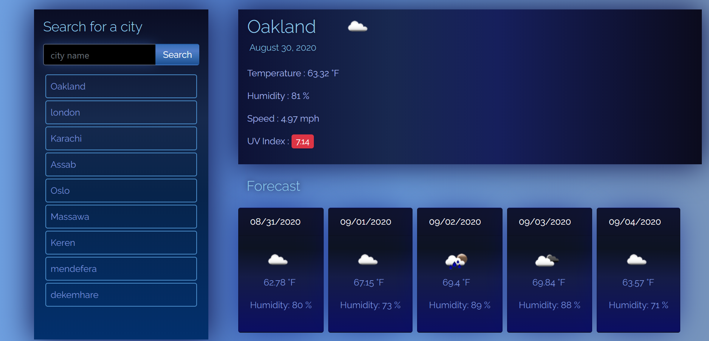
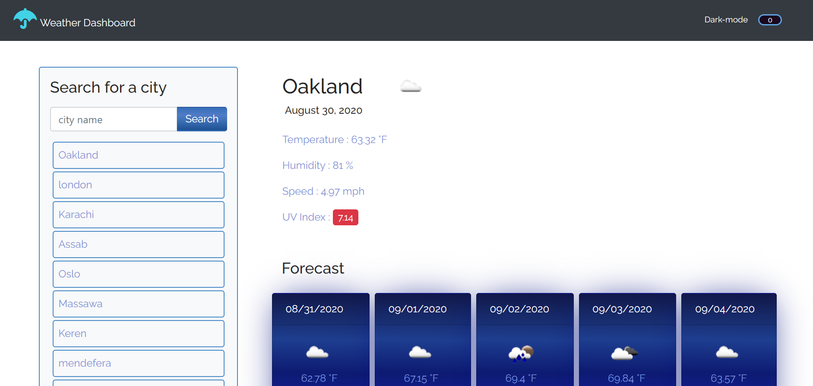
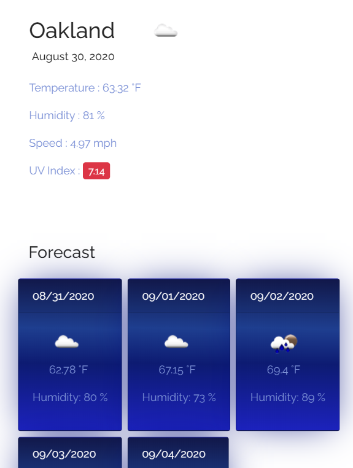
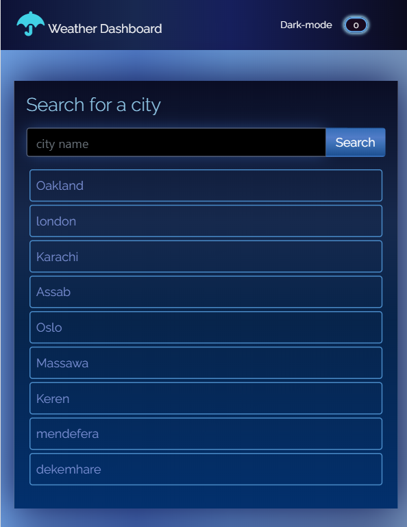
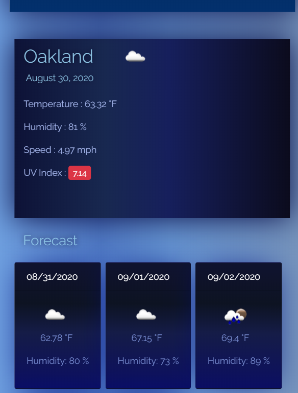
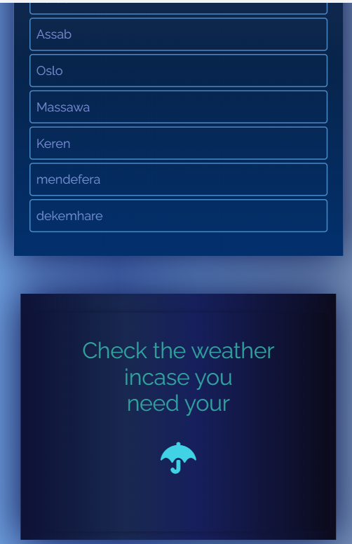
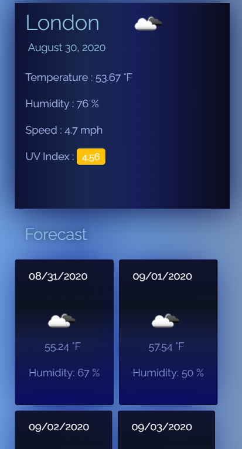
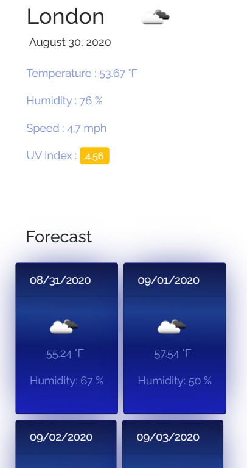

# weather-app

## Purpose

An app to help you schedule your plans in a daily basis

## Description

AN Application that helps you to check current weather and five days forecast with its temperature,humidity,and UV-index; Presents different colors based on uv-index results; Uses openweather api to get its data.It has to light and dark mode with fully responsive desigin;

## Built With

- HTML
- CSS
- JAVASCRIPT
- Moment.js
- OpenWeather-Api

## Website

https://solomonmeresa.github.io/Work-Daily-Scheduler/

## Visuals

Fully - responsive

## Contribution

Made by solomon

### ©️2020 Weather-app
